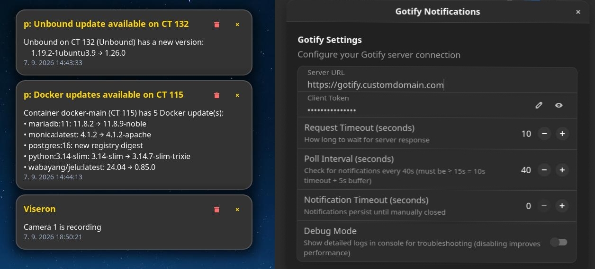

[](#)  [](#) 

Gotify Notifications GNOME Extension
====================================


A GNOME Shell extension that displays persistent notifications from your Gotify server. Features custom notification windows that stay visible until manually closed, completely independent of GNOME's native notification system.


✨ Features
----------

*   🔔 **Independent Persistent Notifications** - Custom notification windows that stay until manually closed
    
*   📝 **Text Wrapping** - Automatic wrapping for long messages with manual line breaking
    
*   ⚙️ **Configurable Settings** - Easy GUI configuration for server URL, secure token and behavior
    
*   🔄 **Auto-Polling** - Automatically checks for new notifications at configurable intervals
    
*   📱 **Status Indicator** - System tray icon showing connection status (bell icons)
    
*   🚫 **Non-Intrusive** - Doesn't interfere with GNOME's native notifications
    
*   🎯 **Stacking Notifications** - Multiple notifications stack neatly at top of screen


    
🚀 Install Now
---------------

### Method 1: 📦 Available on extensions.gnome.org:
Install Gotify Notifications from [extensions.gnome.org](https://extensions.gnome.org/extension/8794/gotify-notifications/)

 <a href="https://extensions.gnome.org/extension/8794/gotify-notification" target="_blank"></img></a>
     

    

### Method 2: Manual Installation

 ```bash

# Clone or download this repository
git clone https://github.com/dodog/gotify-notifications.git

# Copy to extensions directory
cp \-r gotify-notifications/gotify-notifications@dodog.github.com ~/.local/share/gnome-shell/extensions/

# Compile schemas
cd ~/.local/share/gnome-shell/extensions/gotify-notifications@dodog.github.com
glib-compile-schemas schemas/

# Enable the extension
gnome-extensions enable gotify-notifications@dodog.github.com

# Restart GNOME Shell (logout / login)
 ```


🖼️ Screenshots
---------------


*   Notifications example and Settings panel
  
  

    
    


⚙️ Configuration
----------------

### Gotify Server Setup

1.  **Get Your Client Token:**
    
    *   Open your Gotify web interface
        
    *   Go to Clients → Create a client
        
    *   Copy the client token
        
2.  **Extension Settings:**
    
    *   Click the bell icon in your system tray
        
    *   Select "Settings"
        
    *   Or run: `gnome-extensions prefs gotify-notifications@dodog.github.com`
        


### Available Settings

| Setting              | Type    | Default                  | Description                                           |
|----------------------|---------|--------------------------|-------------------------------------------------------|
| Server URL           | String  | https://gotify.server.url| Your Gotify server address                            |
| Client Token         | String  | (empty)                  | Your Gotify application token                         |
| Reguest timeout      | Integer | 10                       | How long to wait for server response (5-30 seconds)   |
| Poll Interval        | Integer | 20                       | How often to check for notifications (10-300 seconds) |
| Notification Timeout | Integer | 0                        | Auto-close timer (0 = never auto-close)               |

🚀 Usage
--------

### Basic Operation

*   The extension automatically polls your Gotify server for new messages
    
*   Notifications appear as custom windows at the top center of your screen
    
*   Click the `✖` button to close individual notifications
    
*   Use the status menu to test notifications or clear all


### Status Indicator

*   **Bell Icon** (🔔): Connected and polling for notifications
    
*   **Crossed Bell** (🔕): Disconnected or polling stopped
    
*   **Right-click**: Access quick actions and settings
    

### Menu Options

*   **Test Custom Notification**: Send a test notification
    
*   **Connect/Disconnect**: Toggle automatic polling
    
*   **Settings**: Open configuration panel
    
*   **Clear All Notifications**: Remove all active notifications
    

🏗️ Building from Source
------------------------

### Prerequisites

*   GNOME Shell 46+
    
*   `glib-compile-schemas`
    
*   Git
    

### Development Setup

 ```bash

git clone https://github.com/dodog/gotify-notifications.git
cd gnome-gotify-notifications

# Enable development mode
gnome-extensions enable gotify-notifications@dodog.github.com

# Monitor logs for debugging
journalctl \-f \-o cat | grep \-i gotify
 ```


📁 File Structure
-----------------

 ```bash


gotify-notifications@dodog.github.com/
├── extension.js          # Main extension code
├── prefs.js             # Settings panel
├── metadata.json        # Extension metadata
├── stylesheet.css       # Notification styling
└── schemas/
    └── org.gnome.shell.extensions.gotify-notifications.gschema.xml

 ```


🐛 Troubleshooting
------------------

### Common Issues

**Notifications not appearing:**

*   Verify your Gotify server URL and client token
    
*   Enable debug
    
*   Check logs: `journalctl -f -o cat | grep -i gotify`
    

**Extension not loading:**

*   Restart GNOME Shell: `Alt+F2` → `r` → `Enter`
    
*   Check if schemas are compiled: `glib-compile-schemas schemas/`
    
*   Verify installation path
    

**Settings not saving:**

*   Ensure schemas are properly compiled
    
*   Check file permissions

        

📋 Compatibility
----------------

*   **GNOME Shell**: 46, 47, 48, 49
    
*   **Gotify Server**: 2.0+
    

🤝 Contributing
---------------

Contributions are welcome! Please feel free to submit pull requests or open issues for bugs and feature requests.

### Development Guidelines

*   Follow GNOME extension best practices
    
*   Test on multiple GNOME Shell versions
    
*   Ensure compatibility with Gotify API

    

📄 License
----------

This project is licensed under the GPL-3.0 License - see the [LICENSE](https://github.com/dodog/gotify-notifications/blob/main/LICENSE) file for details.

🙏 Acknowledgments
------------------

*   Gotify team for the excellent notification server
    
*   GNOME project for the extension system

    

❓ Support
---------
If this extension is helping you in your daily life you can buy me a coffee.    
[](https://www.buymeacoffee.com/dodog)

*   **Issues**: [GitHub Issues](https://github.com/dodog/gotify-notifications/issues)
    
*   **Gotify Documentation**: [gotify.net](https://gotify.net/docs)
    
*   **GNOME Extensions**: [extensions.gnome.org](https://extensions.gnome.org/)

* * *

**Note**: This extension is not officially affiliated with Gotify or GNOME.
